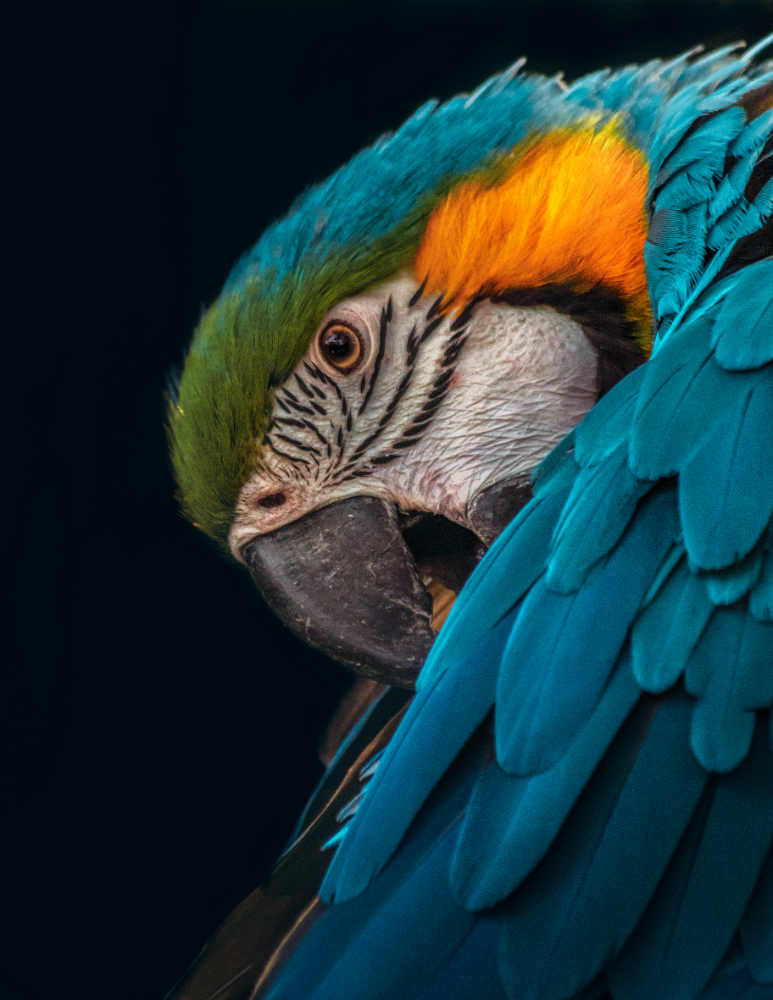

<!-- markdown tutorial -->
Rashed Mahmud   
This is second line

--- 

# Rashed Mahmud 
## Rashed Mahmud   
### Rashed Mahmud  
#### Rashed Mahmud

<p>This is Rashed Mahmud. I am 24 years old. I just finished my masters at Tempare University.</p>

### Italic and bold text
<i>this is italic tag</i>  
_this is an italic test_  
__this is bold test__

### Strikethrough
<del>this is strikethrough</del>  
~~this is also strikethrough~~

### Single line code
`This is inline test`
`<h1>Bangladesh</h1>`

### Multiple line code
```
<html>
<head></head>
<body></body>
</html>
```

```html
<html>
  <head></head>
  <body></body>
</html>
```

```CSS
head {
    background-color: green;
    font-family: cursive;
}
```

```javascript
console.log("hellow");
```

### Order list
1. Item1
2. Item2  
     1. Item2.1
     2. Item2.2
3. Item3 

### Unorder list 
- Item1
  - Item1.1
  - Item1.2
- Item2
- Item3

### Task list
- [x] Task1
- [x] Task1
- [] Task1

### Autometic link
http://www.studywithanis.com

### disable link
`http://www.studywithanis.com`

### Markdown link syntax
`[title](link)`  
`[studywithanis](http://www.studywithanis.com)`  
`[websiteLink]: http://www.studywithanis.com`

[studywithanis](http://www.studywithanis.com)  
[website][websiteLink]  
[facebook](facebookLink)

 <!-- All link is here -->
[websiteLink]: http://www.studywithanis.com
[facebookLink]: http://www.studywithanis.com

### Image syntax
``
<!--  -->


### Add Emoji
😆😆😆😆😆😆😆😆

### Table
| Name | Email |
|------|-------|
|Rashed Mahmud | mahamud2071@gmail.com |
